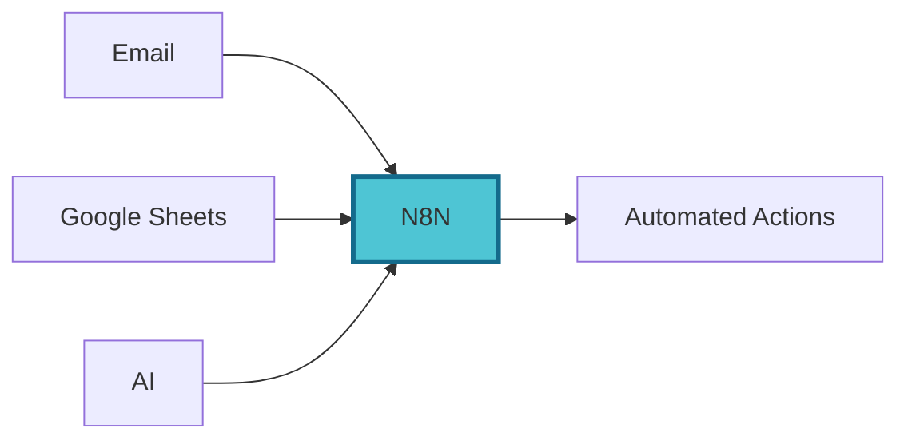
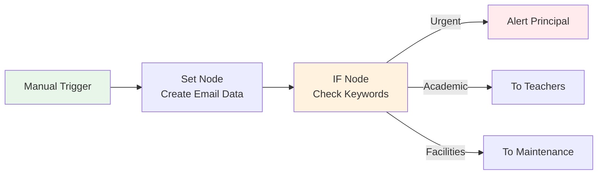

# Topic 1: Foundations & First Workflow <mdi-rocket-launch />

<div class="text-xl mt-8 opacity-80">
60 minutes • Welcome • Setup • First Hands-on Lab
</div>

---
transition: slide-up
---

# What is N8N? <mdi-robot />

<div v-click class="text-xl mt-8 mb-8">
Workflow automation platform - connect apps without coding
</div>

<div v-click>



</div>

<div v-click class="mt-8 p-4 bg-blue-500/20 rounded">
<mdi-lightbulb /> <strong>Think of it as:</strong> Digital workflows that run automatically, connecting your school's tools together
</div>

---
transition: fade-out
layout: two-cols
---

# N8N Interface Tour <mdi-map />

<div class="mt-8">

<div v-click class="mb-6">
<div class="flex items-center gap-3 mb-2">
  <mdi-grid class="text-2xl" />
  <span class="font-bold">Canvas</span>
</div>
<div class="opacity-80">Where you build workflows</div>
</div>

<div v-click class="mb-6">
<div class="flex items-center gap-3 mb-2">
  <mdi-puzzle class="text-2xl" />
  <span class="font-bold">Nodes Panel</span>
</div>
<div class="opacity-80">All available tools & integrations</div>
</div>

<div v-click class="mb-6">
<div class="flex items-center gap-3 mb-2">
  <mdi-play-circle class="text-2xl" />
  <span class="font-bold">Execute Button</span>
</div>
<div class="opacity-80">Run your workflow</div>
</div>

<div v-click>
<div class="flex items-center gap-3 mb-2">
  <mdi-history class="text-2xl" />
  <span class="font-bold">Executions</span>
</div>
<div class="opacity-80">View past runs & results</div>
</div>

</div>

::right::

<div v-click class="mt-16 p-6 border-2 border-main rounded">
<div class="text-4xl mb-4 text-center"><mdi-laptop /></div>
<div class="text-center font-bold text-lg mb-3">Quick Demo</div>
<div class="opacity-80">Watch a simple workflow in action</div>
</div>

---
transition: slide-left
layout: center
class: text-center
---

<div class="text-6xl mb-8"><mdi-coffee /></div>

# Break Time

<div class="text-2xl opacity-80">5 minutes</div>

---
transition: slide-up
layout: center
---

# <mdi-flask /> Hands-on Lab 1

<div class="text-2xl mt-6 mb-12">
Your First Manual Workflow
</div>

<div class="text-xl opacity-80">
30 minutes • Step-by-step • Real school example
</div>

---
transition: fade-out
---

# Lab 1: Parent Email Classifier <mdi-email-check />

<div v-click class="text-lg mt-6 mb-8 opacity-80">
Automatically categorize parent emails and route to right departments
</div>

<div v-click>



</div>

<div v-click class="mt-6 p-4 bg-green-500/20 rounded">
<mdi-lightbulb /> <strong>Real Impact:</strong> Sort hundreds of emails automatically, ensuring urgent issues reach the right person fast
</div>

---
transition: slide-left
---

# Step 1: Create Manual Trigger <mdi-numeric-1-circle />

<div class="mt-8 space-y-4">

<div v-click class="flex items-start gap-4">
<mdi-plus-circle class="text-3xl text-green-500" />
<div>
<div class="font-bold">Click "Add Node"</div>
<div class="opacity-80">Opens the nodes panel</div>
</div>
</div>

<div v-click class="flex items-start gap-4">
<mdi-magnify class="text-3xl text-blue-500" />
<div>
<div class="font-bold">Search "Manual Trigger"</div>
<div class="opacity-80">This lets you start workflows manually</div>
</div>
</div>

<div v-click class="flex items-start gap-4">
<mdi-cursor-default-click class="text-3xl text-purple-500" />
<div>
<div class="font-bold">Add to Canvas</div>
<div class="opacity-80">Your workflow begins here</div>
</div>
</div>

</div>

<div v-click class="mt-8 p-4 bg-blue-500/20 rounded">
<mdi-information /> <strong>Note:</strong> Manual triggers are great for testing and learning
</div>

---
transition: fade-out
---

# Step 2: Add Set Node <mdi-numeric-2-circle />

<div class="mt-6 space-y-4">

<div v-click class="flex items-start gap-4">
<mdi-plus class="text-3xl text-green-500" />
<div>
<div class="font-bold">Add "Set" node after trigger</div>
<div class="opacity-80">Creates or modifies data</div>
</div>
</div>

<div v-click class="mt-6 p-4 bg-gray-500/20 rounded">
<div class="font-bold mb-3">Add these fields:</div>

```json
{
  "emailFrom": "parent@school.com",
  "subject": "Urgent: Bullying Incident",
  "body": "My child reported bullying today...",
  "priority": "high"
}
```
</div>

</div>

<div v-click class="mt-6 p-4 bg-green-500/20 rounded">
<mdi-lightbulb /> <strong>Tip:</strong> This simulates receiving an email
</div>

---
transition: slide-up
---

# Step 3: Add IF Node <mdi-numeric-3-circle />

<div class="mt-6">

<div v-click class="mb-6">
<div class="flex items-center gap-3 mb-3">
<mdi-call-split class="text-3xl text-orange-500" />
<span class="font-bold text-lg">Add "IF" node - Makes decisions based on conditions</span>
</div>
</div>

<div v-click class="grid grid-cols-2 gap-6">

<div class="p-4 bg-red-500/20 rounded">
<div class="font-bold mb-2"><mdi-alert /> Condition 1: Urgent</div>
<code class="text-sm">subject contains "urgent" OR "bullying"</code>
</div>

<div class="p-4 bg-blue-500/20 rounded">
<div class="font-bold mb-2"><mdi-book /> Condition 2: Academic</div>
<code class="text-sm">subject contains "grades" OR "homework"</code>
</div>

<div class="p-4 bg-green-500/20 rounded">
<div class="font-bold mb-2"><mdi-hammer-wrench /> Condition 3: Facilities</div>
<code class="text-sm">subject contains "repair" OR "facilities"</code>
</div>

<div class="p-4 bg-gray-500/20 rounded">
<div class="font-bold mb-2"><mdi-dots-horizontal /> Otherwise</div>
<code class="text-sm">Everything else → general inbox</code>
</div>

</div>

</div>

---
transition: fade-out
---

# Step 4: Test Your Workflow <mdi-numeric-4-circle />

<div class="mt-8 space-y-6">

<div v-click class="flex items-start gap-4">
<mdi-play-circle class="text-4xl text-green-500" />
<div>
<div class="font-bold text-lg">Click "Execute Workflow"</div>
<div class="opacity-80">Runs your automation</div>
</div>
</div>

<div v-click class="flex items-start gap-4">
<mdi-eye class="text-4xl text-blue-500" />
<div>
<div class="font-bold text-lg">View Results</div>
<div class="opacity-80">See which path the email took</div>
</div>
</div>

<div v-click class="flex items-start gap-4">
<mdi-test-tube class="text-4xl text-purple-500" />
<div>
<div class="font-bold text-lg">Try Different Emails</div>
<div class="opacity-80">Change subject line, test other keywords</div>
</div>
</div>

</div>

<div v-click class="mt-8 p-4 bg-green-500/20 rounded">
<mdi-check-circle /> <strong>Success!</strong> You've built your first workflow
</div>

---
transition: slide-left
---

# Practice Challenge <mdi-trophy />

<div class="mt-8 p-6 bg-purple-500/20 rounded">

<div class="text-lg font-bold mb-4"><mdi-pencil /> Try This:</div>

<div class="space-y-3">
<div v-click><mdi-checkbox-marked-circle class="text-green-500" /> Add a 4th category: "Finance" (fee, payment, invoice)</div>
<div v-click><mdi-checkbox-marked-circle class="text-green-500" /> Test with different email subjects</div>
<div v-click><mdi-checkbox-marked-circle class="text-green-500" /> What happens with emails that don't match any category?</div>
</div>

</div>

<div v-click class="mt-8 text-center text-xl opacity-80">
<mdi-timer-outline /> Time remaining: Check with instructor
</div>

---
transition: fade-out
layout: center
class: text-center
---

# Q&A <mdi-comment-question />

<div class="text-xl mt-8 opacity-80">
5 minutes • Ask anything about what we've covered
</div>

<div class="mt-12 grid grid-cols-3 gap-6 text-left">
<div v-click class="p-4 border border-main rounded">
<mdi-robot class="text-3xl mb-2" />
<div class="text-sm opacity-80">What is N8N?</div>
</div>

<div v-click class="p-4 border border-main rounded">
<mdi-puzzle class="text-3xl mb-2" />
<div class="text-sm opacity-80">How nodes work?</div>
</div>

<div v-click class="p-4 border border-main rounded">
<mdi-flask class="text-3xl mb-2" />
<div class="text-sm opacity-80">Lab questions?</div>
</div>
</div>
